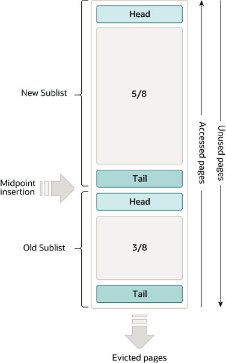

### MySQL的学习

#### 什么是MySQL
MySQL 是一个关系型数据库管理系统（RDBMS）。，是一款存放和管理数据的软件, 它介于应用和数据之间，通过一些设计，将大量数据，变成一张张像 excel 的数据表。为应用提供创建(Create), 读取(Read), 更新(Update), 删除(Delete)等核心操作。它以一个长期运行的服务进程存在，接收客户端发来的 SQL，把数据按表、行、列和关系管理起来，并处理并发、权限、事务、恢复与查询优化。不只是数据像 Excel 表格，而是表之间可以通过键建立可验证的业务关系。
MySQL 在一个真实后端中的位置以用户创建订单为例：
```
浏览器 / App
   ↓ HTTP
后端服务（Rust / Go / Node.js）
   ↓ SQL + 数据库连接
MySQL Server
   ↓
磁盘中的数据与日志
```
后端不会直接操作 MySQL 的数据文件。它通过驱动或 ORM 建立连接、发送 SQL、接收结果。
在数据量小、没有并发时，JSON、CSV、Excel 都能存数据。但一旦成为在线业务系统，就会遇到几个硬问题:
并发问题例如,两个用户同时抢最后一件商品，文件系统不会自动替你正确处理这个业务并发。MySQL 的事务与锁机制就是为这种问题服务的；后面讲 Undo Log、Redo Log 和锁时，会把这个例子完整跑通。查询问题，如果订单有一千万条，想找用户a最近的20条已支付订单,文件方式往往意味着读很多内容、需要自己过滤，MySQL 可以通过索引缩小范围，仅访问必要数据，一致性问题，下单通常至少涉及两次修改，创建订单-扣减库存，如果订单创建成功、扣库存失败，系统数据就不一致。MySQL 的事务让这两步成为一个整体，要么都成功，要么都失败。

#### 数据页
mysql 将数据组织成 excel 表的样子。excel 文件在磁盘上是个xls 文件，mysql 的数据表也类似，在磁盘上则是个ibd 后缀的文件。数据表越大，磁盘上的 ibd 文件也就越大。直接读写一个大文件里的全部数据会很慢，所以 MySQL 将数据拆成一个个数据页，每页大小 16KB。这样我们读写部分表数据的时候，就只需要读取磁盘里的几个数据页就好。假如一张表有一千万行，磁盘上不可能把每一行当作一个单独的小文件管理，那样随机 I/O 和查找成本都会极高。InnoDB 的做法是：将数据和索引划分为固定大小的页，再以页作为大多数 I/O、缓存和索引树管理的基本单位。索引页默认大小是 16KB。这样我们读写部分表数据的时候，就只需要读取磁盘里的几个数据页就好。

#### 索引
但数据页那么多，查某条数据时，怎么知道要读哪些数据页？可以为每个数据页加入页号，再为每行数据加个序号，这个序号其实就是所谓的主键。按主键大小排序，将每个数据页里最小的主键序号和所在页的页号提出来，放入到一个新生成的数据页中，并且给数据页加入层级的概念。样我们就可以通过上层的数据页快速缩小查找范围，加速查找数据页的过程。现在页跟页之间看起来就像是一棵倒过来的树，这棵可以加速查找数据页的树，就是常说的B+树（B-tree）索引。以上是针对主键的索引，也就是主键索引。按同样的思路，也可以为其他数据表的列去建立索引，比如用户表的名称字段，这样我们就能快速查找到名字为A的用户有哪些，这就是所谓的辅助索引。

在 InnoDB 中，表数据并不是独立放一份、主键索引再放一份。主键索引的叶子节点保存完整行数据，因此它也被称为聚簇索引：
```SQL
CREATE TABLE orders (
  id BIGINT NOT NULL AUTO_INCREMENT,
  user_id BIGINT NOT NULL,
  order_no VARCHAR(32) NOT NULL,
  total_amount DECIMAL(12, 2) NOT NULL,
  PRIMARY KEY (id)
);
```
这里的 PRIMARY KEY (id) 就是聚簇索引。把id设为主键,此外需要注意的是，如果将id设为了主键需要注意id不能为空，并且id必须唯一。
除聚簇索引外的索引，统称二级索引，辅助索引，用一个例子说明白主键索引和辅助索引的关系，假设有一张表，假设表中有数据：
```
| id | user_id | order_no | total_amount |
|---:|---:|---|---:|
| 1 | a | O001 | 99.00 |
| 2 | b | O002 | 199.00 |
| 3 | a | O003 | 59.00 |
| 4 | b | O004 | 88.00 |
```
如果现在执行SELECT * FROM orders WHERE user_id = b
此时只有 id 是主键索引，user_id 没有索引,MySQL 不知道值为 b 的记录在哪，只能一行行判断。
```
id=1，user_id=7，跳过
id=2，user_id=42，保留
id=3，user_id=7，跳过
id=4，user_id=42，保留
```
当时数据量少的时候没问题，但是如果数据有千万行，每次执行请求的时候都这样扫，接口自然就慢。解决的方案就是给user_id建立辅助索引。
```
CREATE INDEX idx_orders_user_id ON orders(user_id);
```
MySQL 会额外维护一个按 user_id 排序的目录：
```
user_id 索引：

7  → id=1
7  → id=3
42 → id=2
42 → id=4
```
再次执行SELECT b的指令的时候MySQL会先查目录找到 user_id = 42 → 得到 id = 2、id = 4 → 找到两条完整订单。因此，索引的作用不是让数据库更聪明，而是避免无意义地检查大量不相关数据。但是索引提升读性能，但增加存储与写入成本，所以按高频查询建。

#### Buffer Pool
但就算有了索引，数据也还是在磁盘上。每次都读磁盘太慢了。MySQL在磁盘数据和应用之间，加一层进程内缓存，缓存里装的就是前面提到的 16KB 数据和索引页, 它就是所谓的 Buffer Pool。读数据的时候优先读 Buffer Pool，有数据就返回，没数据才去磁盘里读取，减少了读磁盘的次数，大大提升了性能。一次典型的查询：
```
SQL：查询 id = 1001 的订单
  ↓
主键索引定位到目标数据页
  ↓
Buffer Pool 中有这页？
  ├─ 有：内存读取，快
  └─ 没有：磁盘读取该页，再放进 Buffer Pool
```
Buffer Pool 里缓存两种东西1.表数据页2.索引页，如果它们都在 Buffer Pool 中，查询几乎不用等待磁盘 I/O。因此，索引与 Buffer Pool 的关系是：
索引：告诉 MySQL 该访问哪一页
Buffer Pool：尽量让这一页已经在内存中
两者是配合关系，不是替代关系。
但是内存有限，Buffer Pool 放不下整个数据库时，InnoDB 必须淘汰不常使用的页，为新页腾位置。最近常用的数据页尽量留下，长期不用的数据页优先淘汰，官方文档说明，InnoDB 使用一种改进的 LRU（最近最少使用）策略管理页：经常使用的页保留在较“年轻”的区域，较少使用的页会逐步进入更容易被淘汰的区域。
官方文档也提到，专用服务器常将最高约 80% 的物理内存分配给它，但前提是仍给操作系统与其他进程留下空间。但是具体的实际操作还是要做一些平衡Buffer Pool 太小会导致热点页频繁被淘汰，延迟升高。Buffer Pool 太大会导致操作系统或其他进程内存不足，性能反而更差。


#### 自适应哈希索引（Adaptive Hash Index，AHI）
就算有了 buffer pool，要查到某个数据页，也依然要查找 B+树，查询复杂度 O(lgn)。自适应哈希表就是再次基础上进行优化，使用查询复杂度为 O(1)。记录每个数据页的查询频率，对于热点数据页，我们以查询的值为 key，数据页地址为 value，构建 hash 表。如果B+ 树索引像按字母或拼音排好的纸质目录的话，自适应哈希索引像手机通讯录的快速映射，key → value。对于合适的等值查找，哈希表平均可以非常快地定位目标；但它不适合范围查询。因为哈希表没有顺序概念。你问它 1，它能直接找；你问它“1 到 100 所有值”，它无法像 B+ 树那样沿着有序叶子页持续向后扫描。
此外自适应哈希表它有三个自动特征：自动观察查询模式、自动决定是否建立、自动决定只为哪些热点索引页建立。
总结一下三者之间的关系：
```
| 组件 | 本质 | 谁创建 | 是否落盘 |
|---|---|---|---|
| 普通 B+ 树索引 | 业务查询的正式目录 | 开发者通过 DDL 创建 | 是 |
| Buffer Pool | 数据页和索引页的内存缓存 | InnoDB 自动管理 | 否 |
| 自适应哈希索引 | 热点 B+ 树访问的内存加速路径 | InnoDB 自动管理 | 否 |
```
#### Change Buffer
有了自适应hash和索引的加持，读性能提高了。接下来就是要想到如何提高写入的性能了，大部分数据表，除了主键索引外，我们还会加一些辅助索引。比如对用户名加个辅助索引。那对于这类数据表的写操作，更新完主键索引的数据页之后，还需要更新辅助索引页。这样读取辅助索引页的磁盘 IO 必然少不了。我们可以先将要写入的数据收集到一块内存里，等哪天磁盘里的索引页正好被读入 Buffer pool 的时候，再将写入数据应用到索引页中。通过这个方式减少大量的磁盘 IO，提升性能。而这个将写操作收集起来的地方，就是所谓的 Change Buffer，它其实是 Buffer pool 的一部分。
```
写入一条订单
  ↓
发现目标二级索引页不在 Buffer Pool
  ↓
先把“对该二级索引的变更”暂存到 Change Buffer
  ↓
以后该二级索引页因查询等原因进入 Buffer Pool
  ↓
把之前积累的变更合并进去
```
相当于是先记在待办清单，下次的时候再一起改，Change Buffer 是 InnoDB 内部持久化与合并机制的一部分，不是把业务数据延迟生效。对事务、查询和一致性而言，InnoDB 会正确处理这些待合并变更。此外它不适用于主键索引。


#### Undo Log
在数据库中，有一个叫事务的概念。简单来说，就是可以让多行数据，要么同时更新成功，要么同时更新失败。也就是所谓的原子性。为了实现这一点，我们就需要知道写数据时每行数据原来长啥样，方便对更新后的数据行，进行回滚，因此就有了 Undo Log。假如有一笔支付订单，支付成功时，要完成两步，第一步：订单改为已支付，第二步：库存减一，如果第一步成功，第二步因某种原因失败：这就出现了业务不一致：系统显示订单已支付，却没有扣库存。所以我们把多步操作放入事务，如果中途出错MySQL 必须知道订单修改前是什么样，库存修改前是多少，才能恢复原状。Undo Log 就承担这项工作。更新 buffer pool 数据页的时候，会用旧数据生成 undo log 记录，存储在 Buffer Pool 中的特殊 undo log 内存页中。并随着 buffer pool 的刷盘机制，不定时写入到磁盘的 undo log 文件中。

#### Redo Log
Undo 负责撤回，Redo 负责已经提交的修改在宕机后如何恢复；两者方向相反。上面提到的Undo Log都是 buffer pool 相关的内容，它们本质上都是内存。如果内存数据只写了一半到磁盘中，数据库进程就崩了，那一个事务里的多行数据就没能做到同时更新成功。我们将事务中更新数据行的操作都写入到 redo log buffer 内存中，然后在事务提交的时候进行 redo log 刷磁盘，将数据固化到 redo log 文件中。数据库进程崩溃重启后，就能通过 redo log file 找到历史操作记录，重做数据。保证了事务里的多行数据变更，要么都成功，要么都失败。redo log file 是顺序写入的，buffer pool 的内存数据是随机分散在磁盘各处的，顺序写磁盘性能是随机写的几十倍，所以很多存储系统在写数据时都会搞个日志来记录操作，方便服务重启后进行数据对账，确保数据的一致性和完整性，这类操作就是所谓的 Write-Ahead Logging (WAL) 。
此外redo log buffer 也是内存，buffer pool 也是内存，如果 redo log buffer 里的数据还没来得及写入到 redo log，数据库进程就崩了，那redo log buffer里的数据也会丢失，所以 redo log 的作用并不是保证所有数据不丢失，而是确保已提交事务的变更不会丢失。但因为 redo log 刷盘频率很高，所以丢失数据的概率很低。redo log 本质上是写入性能和数据完整性折中的产物。

#### InnoDB 和Server 层
我们将上面提到的内容，分为内存和磁盘两部分，一部分是内存里的自适应哈希，buffer pool，以及 redo log buffer。另一部分是磁盘里存放行数据和索引的.ibd 文件, 以及 undo log, redo log 等文件。它们共同构成了 innodb 存储引擎。并对外提供一系列函数接口。
```
InnoDB
├─ 内存部分
│  ├─ Buffer Pool
│  ├─ Adaptive Hash Index
│  ├─ Change Buffer（配置允许时）
│  └─ Log Buffer
│
└─ 磁盘与持久化部分
   ├─ 表数据与索引页
   ├─ Undo Log
   └─ Redo Log
```
我们平时写的 SQL 语句，最终都会转换成 InnoDB 提供的这些接口函数调用。比如：NSERT 语句会调用 write_row() 接口来插入数据行。UPDATE 语句会调用 update_row() 接口来更新数据行。CREATE TABLE 语句会调用 create() 接口来创建新表。DROP TABLE 语句会调用 drop() 接口来删除表。
Server 层，本质上是 SQL 语句 和 InnoDB 存储引擎之间的中间层。在 Server 层内提供一个连接管理模块，用于管理来自应用的网络连接。并提供一个分析器，用于判断 SQL 语句有没有语法错误，再提供一个优化器，用于根据一定的规则选择该用什么索引，生成执行计划。之后，提供一个执行器，根据执行计划去调用Innodb 存储引擎的接口函数。server 层和存储引擎层共同构成了一个完整的数据库，它就是我们常说的 Mysql 数据库。


#### 参考资料
https://dev.mysql.com/doc/refman/8.4/en/what-is-mysql.html
https://dev.mysql.com/doc/refman/8.4/en/innodb-physical-structure.html
https://dev.mysql.com/doc/refman/8.4/en/innodb-index-types.html
https://dev.mysql.com/doc/refman/8.4/en/innodb-buffer-pool.html
https://dev.mysql.com/doc/refman/8.4/en/innodb-adaptive-hash.html
https://dev.mysql.com/doc/refman/8.4/en/innodb-change-buffer.html
https://dev.mysql.com/doc/refman/8.4/en/innodb-on-disk-structures.html
