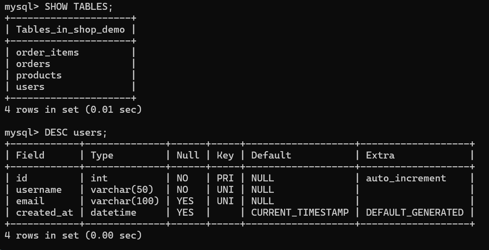
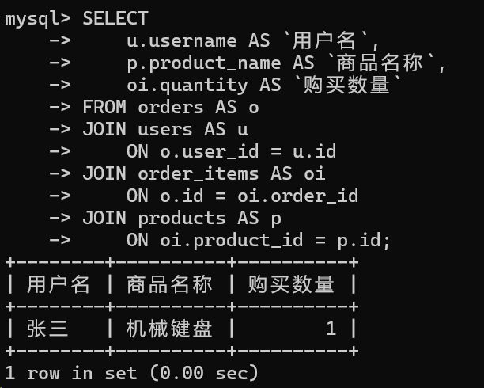

### MySQL实操
#### 创建数据库
建立一个简单的商城数据库进行练习。首先在装好环境的情况下登录到MySQL：
```pwsh
mysql -u root -p
```
创建一个名为 shop_demo 的数据库：
```SQL
CREATE DATABASE IF NOT EXISTS shop_demo
CHARACTER SET utf8mb4
COLLATE utf8mb4_unicode_ci;
```
这里使用 utf8mb4，可以较好地支持中文和特殊字符。
可以使用以下和三个指令选择数据库和查看当前使用的数据库和删除数据库。
```SQL
USE shop_demo;
SELECT DATABASE();
DROP DATABASE shop_demo;（删除数据库会删除其中的所有表和数据）
```
接下来进行数据表的创建：
```
CREATE TABLE users (
    id INT PRIMARY KEY AUTO_INCREMENT,
    username VARCHAR(50) NOT NULL UNIQUE,
    email VARCHAR(100) UNIQUE,
    created_at DATETIME DEFAULT CURRENT_TIMESTAMP
);
```
解析：
id: 用户 id，整数类型，作为主键，自增长。
username: 用户名，变长字符串，不允许为空，不能重复。
email: 用户邮箱，变长字符串，不允许为空。
created_at: 用户注册时间字段，日期和时间类型，如果插入数据时不指定时间，就自动使用当前时间。
#### 创建数据表
接下来创建另外几个商品表、订单表、订单明显表：
```SQL
CREATE TABLE products (
    id INT PRIMARY KEY AUTO_INCREMENT,
    product_name VARCHAR(100) NOT NULL,
    price DECIMAL(10,2) NOT NULL,
    stock INT NOT NULL DEFAULT 0,
    created_at DATETIME DEFAULT CURRENT_TIMESTAMP
);

CREATE TABLE orders (
    id INT PRIMARY KEY AUTO_INCREMENT,
    user_id INT NOT NULL,
    total_amount DECIMAL(10,2) NOT NULL DEFAULT 0,
    status VARCHAR(20) NOT NULL DEFAULT '待支付',
    created_at DATETIME DEFAULT CURRENT_TIMESTAMP,

    FOREIGN KEY (user_id) REFERENCES users(id)
);
CREATE TABLE order_items (
    id INT PRIMARY KEY AUTO_INCREMENT,
    order_id INT NOT NULL,
    product_id INT NOT NULL,
    quantity INT NOT NULL,
    price DECIMAL(10,2) NOT NULL,

    FOREIGN KEY (order_id) REFERENCES orders(id),
    FOREIGN KEY (product_id) REFERENCES products(id)
);
```
其中需要特别注意的是order_items 表中的 order_id，必须对应 orders 表中已经存在的 id。
创建完之后可以通过命令来查看数据库的表和表的结构：
```SQL
SHOW TABLES;
DESC users;
```

```SQL
DROP TABLE users;
DROP TABLE [IF EXISTS] users;
```
删除数据表指令，IF EXISTS 是一个可选的子句，表示如果表存在才执行删除操作，避免因为表不存在而引发错误。

#### 插入测试数据
```SQL
INSERT INTO users (username, email)
VALUES
('张三', 'zhangsan@example.com'),
('李四', 'lisi@example.com'),
('王五', 'wangwu@example.com');

INSERT INTO products (product_name, price, stock)
VALUES
('机械键盘', 299.00, 20),
('无线鼠标', 99.00, 50),
('显示器', 1299.00, 10);
```
分别是插入用户和插入商品，插入数据后，可以通过以下语句查看：
```SQL
SELECT * FROM users;
SELECT * FROM products;
```
#### 基本查询
```SQL
SELECT *
FROM products
WHERE price > 100;

SELECT *
FROM products
WHERE price BETWEEN 100 AND 1000;

SELECT *
FROM products
WHERE product_name LIKE '%鼠标%';

SELECT *
FROM products
ORDER BY price DESC;

SELECT COUNT(*) AS product_count
FROM products;
```
这几个查询分别表示：查询价格大于 100 元的商品、查询价格在 100 到 1000 元之间的商品、查询商品名称中包含“鼠标”的商品、按照价格从高到低排序、统计商品数量。
其中各子句的含义：
| 关键字 | 作用 |
|:---|:---:|
| `FROM` | 指定数据来源表 |
| `WHERE` | 筛选符合条件的数据 |
| `BETWEEN` | 查询某个范围内的数据 |
| `LIKE` | 进行模糊查询 |
| `ORDER BY` | 对查询结果进行排序 |
| `COUNT(*)` | 统计数据行数 |
| `AS` | 给字段或查询结果设置别名 |

#### 修改和删除数据
```SQL
UPDATE products
SET price = 259.00
WHERE product_name = '机械键盘';

UPDATE products
SET stock = stock + 10
WHERE id = 1;

DELETE FROM users
WHERE username = '王五';
```
上面分别表示了修改机械键盘的价格、增加商品库存、删除某个用户。需要特别注意的是 UPDATE 和 DELETE 是一个可选的子句，用于指定删除的行。如果省略 WHERE 子句，将更新/删除表中的所有行。

#### 多表查询
要想将这几个表链接在一起首先插入一条订单和订单明细：
```SQL
INSERT INTO orders (user_id, total_amount, status)
VALUES (1, 299.00, '待支付');

INSERT INTO order_items
(order_id, product_id, quantity, price)
VALUES
(1, 1, 1, 259.00);
```
然后执行:
```SQL
SELECT
    u.username AS `用户名`,
    p.product_name AS `商品名称`,
    oi.quantity AS `购买数量`
FROM orders AS o
JOIN users AS u
    ON o.user_id = u.id
JOIN order_items AS oi
    ON o.id = oi.order_id
JOIN products AS p
    ON oi.product_id = p.id;
```
意思是查询用户名、商品名称和购买数量。分别将四张表链接在了一起。此外如果将 JOIN改成LEFT JOIN（左连接）将会变成获取左表所有记录，即使右表没有对应匹配的记录。同理RIGHT JOIN（右连接）与 LEFT JOIN 相反，用于获取右表所有记录，即使左表没有对应匹配的记录。


#### 事务
事务可以理解为一组必须“全部成功或全部失败”的 SQL 操作。事务是必须满足4个条件（ACID）：：原子性（Atomicity，或称不可分割性）、一致性（Consistency）、隔离性（Isolation，又称独立性）、持久性（Durability）。
原子性：一个事务（transaction）中的所有操作，要么全部完成，要么全部不完成，不会结束在中间某个环节。事务在执行过程中发生错误，会被回滚（Rollback）到事务开始前的状态，就像这个事务从来没有执行过一样。
一致性：在事务开始之前和事务结束以后，数据库的完整性没有被破坏。这表示写入的资料必须完全符合所有的预设规则，这包含资料的精确度、串联性以及后续数据库可以自发性地完成预定的工作。
隔离性：数据库允许多个并发事务同时对其数据进行读写和修改的能力，隔离性可以防止多个事务并发执行时由于交叉执行而导致数据的不一致。事务隔离分为不同级别，包括读未提交（Read uncommitted）、读提交（read committed）、可重复读（repeatable read）和串行化（Serializable）。
持久性：事务处理结束后，对数据的修改就是永久的，即便系统故障也不会丢失。

例如用户下单时，通常需要完成以下操作：
1. 创建订单
2. 添加订单明细
3. 扣减商品库存
4. 修改订单状态
如果库存扣减失败，前面创建的订单也应该撤销，这时就需要使用事务：
```SQL
START TRANSACTION;
INSERT INTO orders
(user_id, total_amount, status)
VALUES
(1, 497.00, '已支付');

SET @order_id = LAST_INSERT_ID();

INSERT INTO order_items
(order_id, product_id, quantity, price)
VALUES
(@order_id, 1, 1, 259.00),
(@order_id, 2, 2, 99.00);

UPDATE products
SET stock = stock - 1
WHERE id = 1
  AND stock >= 1;

UPDATE products
SET stock = stock - 2
WHERE id = 2
  AND stock >= 2;

COMMIT;
```
其中最后的COMMIT表示保存所有的操作，如果发现库存不足，或者某一步执行失败，不要执行 COMMIT，而是执行：ROLLBACK;这样本次事务中的操作都会撤销。


### 参考资料
- [MySQL 教程 | 菜鸟教程](https://dev.mysql.com/doc/refman/8.4/en/what-is-mysql.html)