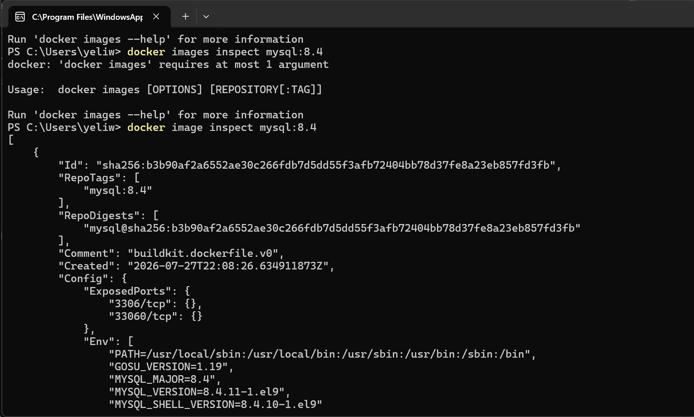
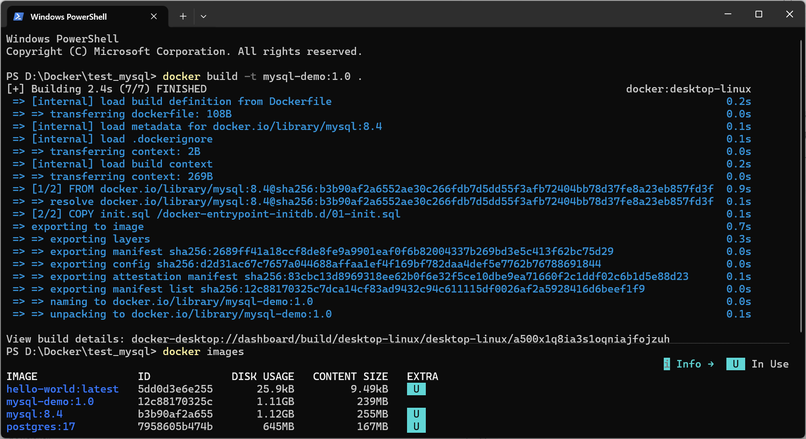
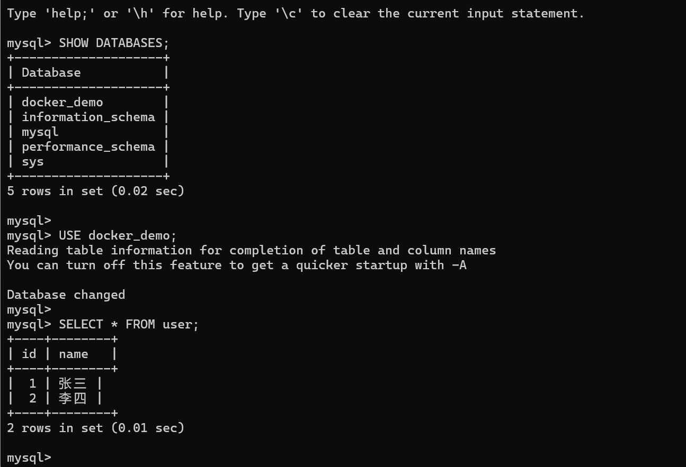
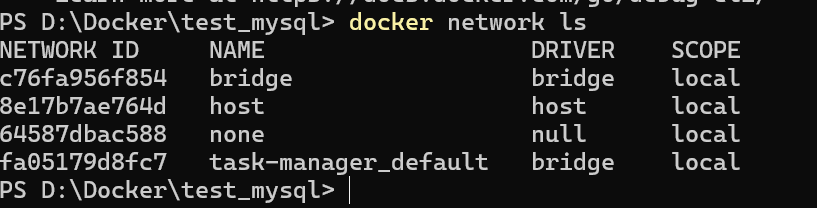

### Docker：镜像、容器与多服务编排

#### Docker 是什么

在传统开发过程中，一个项目能否正常运行，除了依赖源代码，还受到操作系统、编程语言版本、第三方库、环境变量和配置文件等因素影响。例如，一个 Go 项目可能要求特定版本的 Go；一个 Node.js 项目可能要求特定版本的 Node.js 和 npm。开发、测试和生产环境配置不一致时，项目就可能出现运行错误。

Docker 的思路是将应用程序和它依赖的运行环境一起封装起来，形成一个可以重复运行的容器。

Docker 中有几个核心概念：

| 概念 | 可以怎么理解 |
|:---|:---|
| Image（镜像） | 用于创建容器的只读模板，包含程序运行所需的文件、依赖和配置 |
| Container（容器） | 镜像运行之后产生的实例，也就是实际启动后的进程 |
| Dockerfile | 镜像的构建说明文件，描述基础镜像、依赖安装、文件复制和启动命令 |
| Registry | 保存和分发镜像的仓库，例如 Docker Hub |

它们之间的关系可以概括为：
```
Dockerfile ──构建──> Image 镜像 ──运行──> Container 容器
```

Docker 容器和虚拟机都可以提供隔离的运行环境，但实现方式不同：虚拟机通常需要虚拟出完整硬件环境，并运行一个完整的客户操作系统；容器则主要隔离应用程序和用户空间，共享宿主机操作系统内核，因此启动更快、资源占用更少。容器本质上仍然是宿主机上的一个特殊进程。

需要注意的是，在 Windows 上使用 Docker Desktop 时，Docker Desktop 通常会通过 WSL2 或轻量级虚拟机运行 Linux 容器。所以虽然操作方式和 Linux 上一致，但底层并不是直接运行在 Windows 内核上。

##### 基本工作流程

开发者编写 Dockerfile，使用 `docker build` 构建镜像；镜像可以保存在本地，也可以推送到 Docker Hub 等镜像仓库；其他机器通过 `docker pull` 下载镜像；最后使用 `docker run` 根据镜像启动容器：
```
编写 Dockerfile
      ↓
docker build 构建镜像
      ↓
docker push 推送镜像
      ↓
docker pull 下载镜像
      ↓
docker run 启动容器
```

第一次运行 Docker 官方提供的测试镜像时，如果本地没有 `hello-world` 镜像，Docker 会先从镜像仓库下载镜像，然后根据镜像创建并启动容器。容器运行完成后会输出欢迎信息并自动退出。这个过程说明了 Docker 的基本机制：
```
本地没有镜像
      ↓
从 Registry 拉取镜像
      ↓
根据镜像创建容器
      ↓
启动容器并执行默认命令
      ↓
程序执行完成，容器退出
```

#### Docker 镜像与镜像管理
Docker 容器并不是凭空创建出来的，而是根据某个镜像启动的运行实例。镜像类似程序安装包或模板，容器则是这个模板真正运行起来之后的实例。

Docker 镜像通常由多层只读文件系统组成，每一层对应镜像构建过程中的一部分内容。分层设计可以复用相同基础层：例如多个应用都基于 `ubuntu` 或 `node` 镜像构建时，它们可以共享相同的基础内容，不需要重复保存，从而减少磁盘空间和网络传输开销。

镜像本身一般不会直接修改；容器运行过程中产生的新文件变化，会写入镜像之上的可写层，默认只属于当前容器。镜像标签如果只写 `latest`，可能会随着镜像仓库更新而发生变化。为了保证项目环境稳定，通常应该指定明确版本。

`docker pull` 用于从镜像仓库下载镜像。如果本地没有对应镜像，Docker 会从 Docker Hub 或配置好的私有仓库中获取。下载完成后，可以使用 `docker images` 查看本地镜像。

还可以使用 `docker image inspect` 查看镜像的配置、环境变量、默认启动命令、工作目录、暴露端口、镜像层和架构等信息。在排查容器启动问题时，`inspect` 是一个非常常用的命令。


#### Docker 容器与容器生命周期
镜像是用于创建容器的只读模板，而容器是镜像启动后的运行实例。一个镜像可以创建多个容器，同一个容器也可以被停止后再次启动。镜像主要负责提供程序和运行环境，容器则负责真正运行程序，因此镜像和容器是模板与实例的关系。
可以使用下面的命令根据 MySQL 镜像创建并启动一个容器：
```bash
docker run -d --name mysql-demo -p 3306:3306 -e MYSQL_ROOT_PASSWORD=123456 mysql:8.4
```
这条命令中：

- `docker run`：创建并启动容器；
- `-d`：让容器在后台运行；
- `--name mysql-demo`：为容器指定名称；
- `-p 3306:3306`：将宿主机 `3306` 端口映射到容器 `3306` 端口；
- `-e MYSQL_ROOT_PASSWORD=123456`：设置 MySQL 的 root 用户密码；
- `mysql:8.4`：使用 MySQL 8.4 镜像。

如果本地没有这个镜像，Docker 会先自动下载镜像，再创建容器。此时可以使用本机 MySQL 客户端连接：

```bash
mysql -h 127.0.0.1 -P 3306 -u root -p
```

接下来可以查看 MySQL 容器日志、停止容器、启动容器：

```bash
docker logs <MySQL容器名称>
docker stop <MySQL容器名称>
docker start <MySQL容器名称>
```
此时 `docker ps` 中看不到该容器，但 `docker ps -a` 仍然可以看到它，只是状态变成了 `Exited`。停止容器并不等于删除容器，容器的配置、名称和关联的数据卷仍然保留。

`docker pause` 会暂停容器中的进程，`docker unpause` 会恢复容器中的进程。不过 MySQL 是数据库服务，实际使用时不建议随意暂停，因为暂停期间 MySQL 无法正常处理新的连接和请求。删除容器前也需要先停止容器。

Docker 容器有一个很重要的特点：容器是否持续运行，取决于容器中的主进程是否持续运行。MySQL 容器的主进程就是 MySQL 服务；只要 MySQL 服务正常运行，容器就会保持运行；如果 MySQL 主进程结束，容器也会随之退出。

#### Dockerfile 与镜像构建

Dockerfile 是一个普通文本文件，用来描述如何构建 Docker 镜像。它把基础镜像、文件复制、环境配置和初始化操作记录下来，Docker 再根据这些指令生成新的镜像。可以把 Dockerfile 理解为镜像的构建说明书：
```
Dockerfile + 相关文件
          ↓
docker build
          ↓
生成新的 Docker 镜像
          ↓
docker run
          ↓
启动新的 Docker 容器
```

Dockerfile 中最常见的指令是：

| 指令 | 作用 |
|:---|:---|
| `FROM` | 指定基础镜像 |
| `COPY` | 将本地文件复制到镜像中 |
| `RUN` | 在构建镜像时执行命令 |
| `ENV` | 设置环境变量 |
| `EXPOSE` | 说明容器需要使用的端口 |
| `VOLUME` | 声明数据卷 |
| `CMD` / `ENTRYPOINT` | 指定容器启动时执行的命令 |
虽然已经有现成的 mysql:8.4 镜像，但仍然可以基于它构建一个自定义 MySQL 镜像。例如，在一个单独的文件夹中创建 Dockerfile 文件：
```dockerfile
FROM mysql:8.4

COPY init.sql /docker-entrypoint-initdb.d/01-init.sql
```
同时在同一个文件夹中创建 init.sql 文件：

```sql
CREATE DATABASE IF NOT EXISTS docker_demo;

USE docker_demo;

CREATE TABLE IF NOT EXISTS user (
    id INT PRIMARY KEY AUTO_INCREMENT,
    name VARCHAR(50) NOT NULL
);

INSERT INTO user (name) VALUES ('张三'), ('李四');

```

这里的 `FROM mysql:8.4` 表示当前镜像基于官方 MySQL 8.4 镜像构建。`COPY init.sql /docker-entrypoint-initdb.d/01-init.sql` 表示将本地初始化 SQL 文件复制到 MySQL 容器约定的初始化目录中。

MySQL 官方镜像在第一次初始化一个全新的数据目录时，会执行 `/docker-entrypoint-initdb.d/` 目录下的 `.sql`、`.sh` 等文件，因此可以通过这种方式自动创建数据库、表和初始化数据。在 Dockerfile 和 init.sql 所在目录中执行：

```bash
docker build -t mysql-demo:1.0 .
```

其中，`docker build` 表示构建镜像；`-t mysql-demo:1.0` 表示给生成镜像命名为 `mysql-demo`，标签为 `1.0`；最后的 `.` 表示使用当前目录作为构建上下文。构建上下文是 Docker 在构建过程中可以访问的文件范围，因此 Dockerfile 和 init.sql 都需要位于当前目录或其子目录中。
构建完成后，可以查看新生成的镜像。


这时候镜像已经构建完成，可以根据它创建一个新的测试容器：
```docker
docker run -d --name mysql-demo-container -p 3307:3306 -e MYSQL_ROOT_PASSWORD=123456 mysql-demo:1.0
```
如果 MySQL 启动成功，可以进入容器中的 MySQL：

```bash
docker exec -it mysql-demo-container mysql -uroot -p
```

输入密码后进入 MySQL，查看一下存储的数据：


如果能够查询到 张三 和 李四，说明 Dockerfile 中复制的初始化 SQL 已经成功执行。
需要注意，MySQL 官方镜像中的初始化脚本通常只会在数据目录第一次初始化时执行。如果容器已经使用了旧的数据卷，后续重新启动容器时，/docker-entrypoint-initdb.d/ 中的 SQL 文件一般不会再次执行。因此，如果修改了 init.sql，直接重启已有容器可能看不到新的数据库内容。学习时可以使用一个全新的测试容器和全新的数据卷验证初始化效果，但不要随意删除正在使用的 MySQL 容器或数据卷。
还需要区分 `RUN`、`CMD` 和 `ENTRYPOINT`：`RUN` 在构建镜像时执行，例如安装依赖或复制文件；`CMD` 用于指定容器默认启动命令；`ENTRYPOINT` 用于指定容器的主要执行程序。

对于 MySQL 官方镜像，MySQL 的启动脚本和默认启动命令已经在基础镜像中配置好了，所以自定义 Dockerfile 通常只需要通过 `COPY` 添加初始化文件，不需要重新编写 MySQL 的启动命令。


#### Docker 网络与数据卷
Docker 网络解决的是容器之间如何通信的问题，数据卷解决的是容器删除或重建后数据如何保留的问题。对于 MySQL 这类数据库服务来说，这两个部分都非常重要：应用容器需要通过网络访问 MySQL，MySQL 数据则需要通过数据卷进行持久化保存。

##### Docker 网络

Docker 安装后会自动创建默认的 bridge 网络。查看当前 Docker 网络：

```bash
docker network ls
```

其中，`bridge` 是默认的桥接网络，`host` 表示使用宿主机网络，`none` 表示不使用网络。平时使用 `docker run` 启动容器时，如果没有指定网络，容器会自动连接到默认的 `bridge` 网络。


在实际项目中，通常不建议让所有容器都使用默认的 bridge 网络，而是创建一个自定义网络：

```bash
docker network create app-network
```
自定义网络的一个重要作用是让同一个网络中的容器可以通过容器名称互相访问。

##### 数据卷

容器本身的文件系统属于容器生命周期的一部分。如果直接将数据库文件保存到容器内部，删除容器后数据可能会丢失。数据卷是 Docker 管理的一种持久化存储方式，它独立于容器存在；即使删除容器，数据卷仍然可以保留。因此，MySQL 的数据目录通常需要挂载数据卷。

创建一个名为 `mysql-data` 的数据卷：

```bash
docker volume create mysql-data
```

查看所有数据卷：

```bash
docker volume ls
```

检查具体数据卷信息：

```bash
docker volume inspect mysql-data
```

使用数据卷创建一个新的 MySQL 测试容器：

```powershell
docker run -d `
  --name mysql-volume-test `
  -p 3307:3306 `
  -e MYSQL_ROOT_PASSWORD=123456 `
  --mount type=volume,src=mysql-data,dst=/var/lib/mysql `
  mysql:8.4
```

也可以使用更短的 `-v` 写法：

```bash
docker run -d --name mysql-volume-test -p 3307:3306 -e MYSQL_ROOT_PASSWORD=123456 -v mysql-data:/var/lib/mysql mysql:8.4
```

这条命令使用 `mysql:8.4` 镜像，创建并后台启动一个名为 `mysql-volume-test` 的 MySQL 容器，同时把 MySQL 数据保存到 Docker 数据卷中。然后进入 MySQL 容器创建测试数据。

进入 MySQL 后执行：

```sql
CREATE DATABASE docker_demo;

USE docker_demo;

CREATE TABLE user (
    id INT PRIMARY KEY AUTO_INCREMENT,
    name VARCHAR(50)
);

INSERT INTO user (name) VALUES ('张三');

SELECT * FROM user;
```
停止并删除测试容器：

```bash
docker stop mysql-volume-test
docker rm mysql-volume-test
```

然后使用同一个数据卷重新创建一个 MySQL 容器，再次进入 MySQL 查询。如果能查到之前插入的“张三”，说明数据已经保存在 `mysql-data` 数据卷中，而不是保存在原来的容器内部。

这个过程说明：容器可以被删除和重新创建，但只要数据卷还存在，数据库数据就可以继续使用。

#### Docker Compose
前面使用 `docker run` 启动 MySQL 时，需要在命令中手动设置容器名称、端口、环境变量和数据卷。当项目中有多个容器时，如果每个容器都单独执行一长串命令，管理起来会比较麻烦。

Docker Compose 可以通过一个 `compose.yaml` 文件统一描述服务、网络、数据卷和环境变量，再使用一条命令创建和启动整套服务。它主要用于管理多容器应用，例如一个项目可能包含后端服务、MySQL 数据库和 Redis 缓存。

如果使用 `docker run`，需要分别启动多个容器；使用 Docker Compose 后，可以将这些配置写入同一个 YAML 文件中，再通过 `docker compose up` 统一启动。

首先创建一个新的文件夹，例如：

```text
mysql-compose
├── compose.yaml
└── init.sql
```

在 `compose.yaml` 文件中写入：

```yaml
services:
  mysql:
    image: mysql:8.4
    container_name: compose-mysql
    environment:
      MYSQL_ROOT_PASSWORD: 123456
      MYSQL_DATABASE: docker_demo
    ports:
      - "3308:3306"
    volumes:
      - mysql-compose-data:/var/lib/mysql
      - ./init.sql:/docker-entrypoint-initdb.d/01-init.sql:ro

volumes:
  mysql-compose-data:
```

这里：

- `services`：应用服务集合；
- `mysql`：服务名称；
- `image`：指定使用 `mysql:8.4` 镜像；
- `container_name`：指定容器名称；
- `environment`：设置 MySQL 的 root 密码和默认数据库；
- `ports`：将宿主机 `3308` 端口映射到容器 `3306` 端口；
- `volumes`：挂载 MySQL 数据卷和初始化 SQL 文件。

其中，`mysql-compose-data:/var/lib/mysql` 表示将名为 `mysql-compose-data` 的 Docker 数据卷挂载到 MySQL 数据目录；`./init.sql:/docker-entrypoint-initdb.d/01-init.sql:ro` 表示将当前目录的 `init.sql` 文件挂载到初始化目录，最后的 `ro` 表示只读。

在 `compose.yaml` 所在目录打开 PowerShell，然后执行：

```bash
docker compose up -d
```

`docker compose up` 会根据 `compose.yaml` 创建需要的网络、数据卷和容器，`-d` 表示让服务在后台运行。

#### Docker Swarm 与 Kubernetes

前面学习的 `docker run`、Dockerfile、数据卷和 Docker Compose，主要用于在一台 Docker 主机上构建和管理容器应用。当应用部署到多台服务器，并且需要自动扩容、故障恢复、负载均衡和滚动更新时，就需要使用容器编排工具。

##### Docker Swarm

Docker Swarm 是 Docker Engine 内置的集群管理功能，可以将多台运行 Docker Engine 的机器组成一个集群。Swarm 集群中的节点主要分为 Manager 和 Worker 两种角色：

- Manager：维护集群状态、调度服务和管理节点；
- Worker：主要负责运行 Manager 分配的任务。

Swarm 中的服务不是单独描述某一个容器，而是描述某个应用服务应该以什么镜像运行、运行几个副本、使用哪些端口和网络等。

初始化一个单节点 Swarm 集群：

```bash
docker swarm init
```

执行后，当前机器会成为 Manager 节点。如果要实现真正的高可用和多机部署，则需要多台可以互相通信的 Docker 主机。初始化 Swarm 后，Docker 会输出加入 Worker 节点所需的命令和 Token，其他机器可以使用这个命令加入集群。

在 Swarm 中，使用 `docker service create` 创建服务。Swarm Manager 会自动创建新的任务；如果某个节点发生故障，Manager 会根据服务的期望状态重新调度任务。

需要注意，MySQL 属于有状态服务，而 Swarm 的服务副本通常更适合无状态应用。Web 服务、API 服务和任务处理服务可以比较容易地运行多个副本；但 MySQL 这类数据库涉及数据卷、主从复制、数据一致性和故障恢复，不能简单地把副本数量设为多个就实现高可用。因此，实际项目中通常会单独设计数据库集群，而不是直接对普通 MySQL 容器执行多副本扩展。

##### Kubernetes

此外，Kubernetes 也是一种容器编排平台，但它的功能范围和生态比 Docker Swarm 更完整。Kubernetes 可以管理容器化应用的部署、扩缩容、服务发现、负载均衡、配置、密钥、存储和故障恢复。

Kubernetes 通常使用 YAML 文件描述应用的期望状态，再由控制器不断调整实际运行状态。可以先把几个工具的适用范围这样理解：

```text
docker run
    ↓
管理单个容器

Docker Compose
    ↓
管理单机上的多容器应用

Docker Swarm
    ↓
管理多台 Docker 主机上的服务

Kubernetes
    ↓
管理大规模、复杂的容器化应用集群
```
Docker Compose 适合本地开发、测试环境和简单部署，例如通过一个 compose.yaml 文件启动后端、MySQL 和 Redis。Docker Swarm 直接集成在 Docker Engine 中，学习成本相对较低，适合 Docker 生态下的基础集群部署。Kubernetes 功能更丰富，适合复杂的生产环境，但学习和运维成本也更高。

### 参考资料

- [Docker 教程（菜鸟教程）](https://www.runoob.com/docker/docker-tutorial.html)
- [Docker Documentation](https://docs.docker.com/manuals/)
- [Docker 基础概念](https://docs.docker.com/get-started/docker-concepts/)
- [Dockerfile reference](https://docs.docker.com/reference/dockerfile/)
- [Docker Compose](https://docs.docker.com/compose/)
- [Docker Volumes](https://docs.docker.com/engine/storage/volumes/)
- [Docker Networking overview](https://docs.docker.com/engine/network/)
- [Docker Swarm mode](https://docs.docker.com/engine/swarm/)
