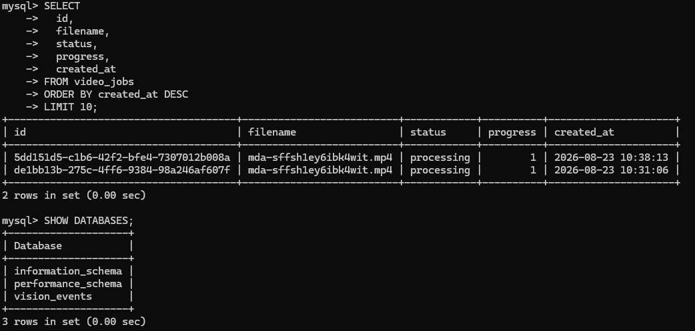
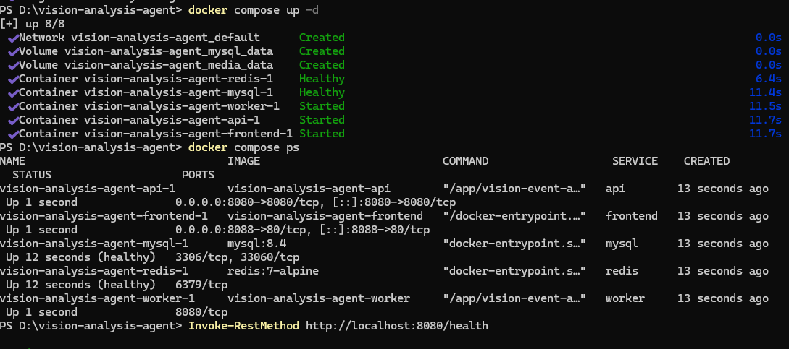

### 今天的项目进展

今天主要围绕视频事件检索平台的基础骨架进行联调。前面学习 Docker、Nginx、Redis 和 MySQL 时，更多是在理解每个工具本身；今天则是把这些东西真正放到了一个项目里。

目前 Rust API、React 前端、Worker、MySQL、Redis 和 Nginx 已经可以通过 Docker Compose 一起启动。前端页面可以访问，API、数据库和缓存服务也都已经接通，视频事件检索的基本页面和任务流程已经有了。

现在还不能说平台已经完成。当前完成的是工程骨架和服务之间的连接，检测器仍然是 MockDetector，大模型也只是预留接口，真实视频链路、YOLO 推理、事件证据和复杂检索还需要继续验证。

## 当前系统的基本流程

目前先按照下面的流程组织：

```text
用户上传视频
    ↓
React 前端
    ↓
Nginx 反向代理
    ↓
Rust API
    ├── MySQL 保存任务信息
    └── Redis 投递异步任务
            ↓
        Worker 处理视频
            ↓
      检测器和规则引擎
            ↓
        MySQL 保存事件
            ↓
        前端查询和复核
```

用户在前端选择视频后，请求先经过 Nginx，再转发给 Rust API。API 保存视频文件，读取文件名和大小等基础信息，尝试读取视频时长和分辨率，然后在 MySQL 中创建一条视频任务记录，最后返回任务 ID。

上传完成后，前端调用处理接口：

```http
POST /api/v1/videos/{job_id}/process
```

API 将任务放入 Redis 队列，并把任务状态设置为 `queued`。Worker 监听 Redis，拿到任务后把状态改为 `processing`，再开始执行后续分析。现在页面上已经能够看到处理任务和进度，当前测试任务显示进度为 1%，说明任务已经进入处理流程。

## 今天搭好的服务骨架

### Nginx：把前端和 API 放到一个入口

今天的 Nginx 不只是一个单独启动的 Web 服务器，而是作为整个系统的入口。前端页面、API 请求和后续的媒体文件访问，都可以从同一个地址进入：

```text
/       → React 前端
/api/   → Rust API
/media/ → 视频、截图和事件片段
```

这样前端不需要直接知道 Rust API 的内部端口，API、MySQL 和 Redis 也不需要对外开放。前端请求 `/api/v1/videos/upload` 时，Nginx 会把请求转给 API；以后视频截图和短片段准备好之后，也可以继续通过 `/media/` 访问。

Nginx 这一层对视频项目还比较重要，因为视频上传和回放都比普通接口更容易遇到大小、超时和权限问题。现在先把路由和反向代理跑通，后面还要继续补上传大小、API 超时、媒体访问控制和日志配置。

今天联调时，前端实际上只需要面对 Nginx 暴露出来的地址，不需要自己区分前端开发端口和 API 端口。这样做以后，前端请求路径可以保持稳定，后面即使 API 换机器、换端口，或者增加 Worker，也不会影响浏览器端的访问方式。Nginx 现在主要做转发，后续还要继续确认上传请求能不能承受真实 MP4 文件，以及 `/media/` 访问视频片段时是否需要权限和过期时间。

目前前端上传视频的请求路径是：

```http
POST /api/v1/videos/upload
```

前端不需要把请求直接发到 Rust 服务的内部地址，而是统一发给 Nginx。Nginx 根据 `/api/` 这个前缀找到 API 服务，把请求体、请求头和必要的代理信息转发过去。以后前端请求事件列表，就是 `GET /api/v1/events`；如果请求某个任务，就是 `GET /api/v1/jobs/{id}`，路径仍然保持一致。

这样做以后，外部访问方式和内部服务实现就分开了。前端只需要知道系统入口，后端服务可以在 Docker 网络里使用服务名通信。后面如果要增加 API 副本，也可以先在 Nginx 后面调整，而不用修改前端代码。

### MySQL：保存任务和事件

今天 MySQL 主要用于保存视频任务和事件数据。视频文件本身不直接存入数据库，数据库保存的是任务和文件之间的关系，例如文件名、文件大小、时长、哈希、处理状态和错误信息。

当前任务状态大致会经历：

```text
pending → queued → processing → completed
                              ↘ failed
                              ↘ cancelled
```

事件表后面需要保存事件类型、严重程度、发生时间、检测目标、置信度、证据地址和版本信息。今天的骨架中已经为事件查询和事件详情预留了位置，后续真实检测结果接入后，再把检测结果和规则结果完整保存下来。

我觉得 MySQL 在这里最重要的作用，不只是把数据保存下来，而是让任务和事件以后可以查、可以分页、可以复核。Redis 里的进度会变化，缓存也可能失效，但任务最后成功还是失败、某个事件什么时候发生，这些内容需要长期保留。

从今天的任务流程来看，MySQL 至少要把“任务本身”和“任务产生的事件”区分开。任务记录需要知道视频来自哪里、文件叫什么、现在处于哪个状态、什么时候开始和结束；事件记录则需要知道发生了什么、发生在视频的哪个时间段、置信度是多少、有没有截图和片段。以后前端按事件类型、状态、时间范围查询时，也需要提前考虑这些字段怎么建索引。

另外，任务状态不能只由前端显示决定。前端显示 `processing`，并不代表 Worker 一定还在正常运行，最终还是要以数据库中的任务状态和错误信息为准。后面还需要补任务失败原因、重试次数、开始时间、结束时间等字段，这样出现问题时才能知道任务停在哪里。


目前 `video_jobs` 可以围绕下面这些字段继续完善：

```text
id              任务 ID
source_uri      视频文件位置
filename        原始文件名
sha256          文件指纹
duration_ms     视频时长
status          当前状态
progress        处理进度
error_code      错误类型
error_message   错误信息
started_at      开始时间
finished_at     结束时间
```

`events` 则需要保存另一类信息：事件是什么、发生在视频什么时间、由什么目标触发、置信度是多少、有没有证据，以及当时使用了哪个规则和模型版本。例如 `person_enter_zone` 事件不能只保存一个标题，还要保存起始时间、结束时间、目标轨迹和区域信息，否则后面无法回放和复核。

今天先把任务查询和事件查询接口接起来，下一步还需要使用真实视频确认：上传完成后数据库里是否真的有任务记录，处理开始后状态是否正确变化，失败时错误信息是否能够保存，事件写入后前端查询是否能拿到同一条数据。

### Redis：把视频处理放到后台

视频处理不适合放在一个普通 API 请求里同步完成。上传一个视频以后，还要抽帧、调用检测器、执行规则判断，后面还可能调用大模型。如果 API 一直等到全部完成，用户需要等待很长时间，失败后也不好重试。

所以今天的骨架里，API 只负责创建任务，Redis 负责传递任务，Worker 负责处理任务：

```text
API 创建任务
    ↓
Redis 队列
    ↓
Worker 消费任务
    ↓
更新任务进度
    ↓
保存最终结果
```

当前先使用 Redis 队列把流程跑通。后面还需要继续完善消费者组、消息确认、失败重试、死信队列和任务超时。特别是 Worker 处理到一半退出以后，任务不能一直卡在 `processing`，同一个任务重复执行时也不能无限生成重复事件。

今天的 Redis 主要验证的是“API 能不能把任务交给 Worker”。真正接入视频以后，还要确认队列中的任务内容是否足够，不能只传一个模糊的任务 ID，至少要能找到视频文件、任务类型和相关配置。Worker 取到任务以后，需要先更新数据库状态，再开始处理；处理成功后写入完成状态，处理失败则记录错误信息，并决定是否重新投递。

队列消息本身也需要定义清楚，不能只写一句“处理这个视频”：

```json
{
  "job_id": "job_001",
  "source_uri": "/media/videos/demo.mp4",
  "detector_version": "mock-v1",
  "rule_version": "rule-v1",
  "created_at": "2026-08-23T10:20:00Z"
}
```

Worker 取到任务以后，先根据 `job_id` 查数据库，确认任务是不是可以处理，再把状态改成 `processing`。如果任务已经是 `completed`，就不应该再次执行；如果任务已经取消，也应该直接结束。处理成功后，Worker 保存事件并把任务改成 `completed`；处理失败则保存错误原因，按照重试次数决定是否再次进入队列。

进度也不能只在 Worker 内存里修改。前端刷新页面以后，仍然需要知道任务走到哪一步，所以可以把当前阶段和百分比写入 Redis，例如：

```text
vision:job:job_001:progress
stage=detecting
percent=45
```

但 Redis 里的进度属于临时状态，任务完成后的最终结果还是要写回 MySQL。

### Docker：让服务一起启动

今天能把前端、API、Worker、MySQL、Redis 和 Nginx 放在一起运行，主要依靠 Docker Compose。当前的服务关系可以理解为：

```text
nginx
  ├── frontend
  └── api
          ├── mysql
          └── redis

worker
  ├── mysql
  └── redis
```

API 和 Worker 可以使用同一套后端代码，但启动命令不同。API 对外提供接口，Worker 在后台消费任务。MySQL 和 Redis 是内部依赖，前端通过 Nginx 访问，不需要自己处理每个服务的端口。

MySQL 数据还需要使用数据卷保存，视频和截图也要使用独立的文件目录或对象存储。否则容器重新创建以后，服务虽然可以重新启动，但里面的数据和文件可能已经不在了。

Docker Compose 这次解决的主要是开发和联调问题。以前启动项目时，需要分别启动前端、后端、数据库和缓存，还要自己记住端口和环境变量；现在可以把这些配置集中到 Compose 中，由服务名连接其他容器。比如 API 连接的不是写死的宿主机地址，而是 Compose 网络里的 MySQL 和 Redis 服务。

不过容器能启动，并不代表整个服务真的可用。MySQL 还需要等待健康检查通过，API 才能正常连接；Redis 虽然显示 `Up`，也还要验证任务是否真的能写入和取出；Worker 显示运行中，也还要确认它是不是在监听正确的队列。因此今天的 `Up` 更像是第一层验证，后面还要继续做接口、任务和数据层面的验证。

Compose 里的服务不能只看端口有没有映射，还要看容器之间的连接方式。浏览器访问的是 Nginx 暴露的端口，Nginx 通过服务名访问 API；API 通过 Docker 网络里的 `mysql` 和 `redis` 访问数据库和缓存；Worker 使用同样的网络连接 MySQL 和 Redis。MySQL、Redis 的端口可以只在内部网络使用，不必全部暴露给外部。


今天通过 Compose 把几个服务一起启动以后，排查问题也有了比较清楚的顺序：先看容器是否启动，再看健康检查，再看 Nginx 是否能访问 API，然后看 API 是否能连接 MySQL 和 Redis，最后看 Worker 是否真的消费到了任务。后面遇到问题时，可以按照这条顺序排查，而不是只盯着前端页面。

## 当前已经完成的内容

### 后端

- Rust Axum API 基础框架已经搭好。
- 视频上传接口已经预留并可以创建任务。
- 视频任务创建和状态查询接口已经完成。
- 事件查询接口已经完成基础结构。
- MySQL 数据持久化已经接通。
- Redis 异步任务队列已经接通。
- Worker 服务已经可以启动并监听任务。
- 检测器接口已经预留，当前使用 MockDetector。
- 规则引擎已经有基础结构。
- 大模型分析接口和分析字段已经预留。

### 前端

- React 前端页面已经搭好。
- 视频事件检索主界面已经可以访问。
- 页面包含事件流和事件详情区域。
- 页面可以展示任务处理进度。
- 页面可以展示事件状态。
- 事件确认和忽略按钮已经预留。
- 前端已经放进 Nginx 容器中运行。

### 部署和联调

- Docker Compose 服务编排已经完成。
- API、Worker 和前端容器可以启动。
- MySQL 容器可以启动并通过健康检查。
- Redis 容器可以启动并通过健康检查。
- 服务之间的端口和网络关系已经接通。
- 前端页面可以正常访问。

当前测试环境中的服务状态如下：

```text
api       Up
worker    Up
frontend  Up
mysql     Up (healthy)
redis     Up (healthy)
```



## 现在还没有完成的部分

今天虽然把骨架搭起来了，但离完整功能还有一段距离：

1. 检测器目前仍然是 MockDetector，还没有接入真实 YOLO。
2. 大模型接口只是预留结构，还没有接入具体模型服务。
3. Redis 队列还需要增加消费者组、ACK 和失败重试。
4. 视频事件的截图和短视频证据还需要完善。


这些内容不能因为页面已经能打开、容器已经显示 `Up` 就当成已经完成。容器启动正常，只能说明服务进程暂时能运行；真实视频能不能处理、任务失败能不能恢复、事件结果准不准确，还需要继续测试。

## 下一步计划


### 接入真实 YOLO

后续可以把 YOLO 单独作为推理服务，避免把模型推理代码直接写进 Rust 业务后端：

```text
Rust Worker
    ↓
调用 YOLO 推理服务
    ↓
返回类别、置信度和边界框
    ↓
规则引擎判断业务事件
```

计划识别的目标包括人员、车辆、安全帽、烟雾、火焰、包裹、叉车和反光背心等。Rust 负责任务调度、数据保存和业务流程，YOLO 服务负责模型推理，这样以后更换模型时影响会小一些。

### 完善事件规则

规则引擎先实现比较明确的场景：人员进入禁区、人员长时间停留、未佩戴安全帽、未穿反光背心、烟火检测、车辆逆行、人员跌倒、区域人数超限、物品遗留和人车混行。

YOLO 负责判断“画面里有什么”，规则引擎负责判断“这是不是一个业务事件”。例如：

```text
检测到 person
    ↓
判断是否进入指定区域
    ↓
判断是否持续超过 10 秒
    ↓
生成 person_enter_zone 事件
```

### 最后再接入大模型

大模型暂时放在后面，主要用于事件摘要、严重程度解释、误报分析、处置建议和自然语言检索。它不应该直接决定是否发生高风险事件，也不应该直接执行删除、停机或其他生产操作。

## 本周总结

这周算是把一条比较完整的学习线走了一遍。看 Nginx 时，主要是在补 HTTP 服务和网关的基础知识；看 MySQL 时，开始从“数据库就是几张表”的理解，往数据页、索引、缓存和事务里面继续往下看；看 Redis 时，重点放在缓存、队列和消息流；看 Docker，把这些服务放到容器和 Compose 里面；今天则真正把它们放进视频事件检索平台的骨架中，看到它们之间应该怎么配合。

学习 Nginx 的时候，我其实是在补一个以前容易忽略的部分：浏览器看到的页面和后端接口，并不是天然就能直接互相访问，中间还需要有一个服务来接收请求、返回静态资源、转发 API。看到反向代理和负载均衡以后，我才比较清楚为什么项目不应该让前端直接记住后端的 IP 和端口。今天 Nginx 能把页面和 API 组织到一起，算是把那天学到的内容第一次放进了实际项目里。

MySQL 这两天的内容比较偏底层，但和今天的任务流程关系很大。以前我只知道创建一张任务表，保存视频名称和状态就可以了；现在会继续想到，事件以后要按什么字段查询，任务失败以后要不要保留错误信息，人工确认事件时要修改哪些数据，规则和模型版本要不要跟着事件一起保存。数据页和索引解决的是查询效率，事务解决的是多张表一起修改时的一致性，这些都不是页面能直接看出来的东西，但以后任务一多就会影响系统。

Redis 让我开始关注“任务怎么走”。如果没有队列，上传接口可能要一直等着视频处理；有了队列以后，又会出现消息丢失、重复消费、任务卡住和失败重试等问题。今天只是把任务从 API 送到 Worker 的第一步跑起来，后面还需要把消费确认和失败处理补好。也就是说，Redis 不是加上以后任务就自动可靠了，队列后面的规则还需要由 Worker 和数据库一起保证。

Docker 则把这些问题放到了同一个环境里。今天能看到 API、Worker、前端、MySQL、Redis 和 Nginx 一起启动，是因为它们的镜像、网络、端口、环境变量和数据卷已经有了基本安排。以前我可能只会把 Docker 当成“启动服务的工具”，现在会更注意服务之间的连接、数据库是否持久化、容器重建以后数据是否还在，以及开发环境和以后生产环境之间有什么差别。

这一周我感觉比较明显的一点，是以前学技术时容易把注意力放在某一个功能上，比如 Redis 有哪些数据结构、Docker 有哪些命令、MySQL 的索引怎么工作。现在再回头看项目，会更容易想到这些技术是为了解决什么问题。Nginx 是为了把前端、API 和媒体访问组织起来，MySQL 是为了保存以后还要查询和复核的任务、事件，Redis 是为了把耗时的视频分析从接口请求里拿出来，Docker 则是为了让这些服务能够在一套环境里启动和联调。

今天看到前端页面可以访问、服务状态显示正常时，说明之前学的内容确实开始落到项目里了。但这也只是第一步。页面能打开不代表视频真的处理成功，任务进入队列也不代表失败以后能够恢复，MySQL 能保存一条记录也不代表事件结构已经适合长期查询。后面还需要用真实视频继续验证，尤其是 Worker 消费、任务状态变化、事件写入和前端展示这一整条链路。

今天的骨架搭好以后，我也能看到项目目前的边界。前端现在主要负责上传、查看任务和展示事件；API 负责接收请求、创建任务和查询数据；Worker 负责后面的耗时处理；MySQL 保存需要长期保留的结果；Redis 负责任务传递和临时状态；Nginx 负责外部访问。这个划分还会继续调整，但比所有代码都放在一个服务里更容易往后扩展。

我现在比较想先把真实视频链路跑通，而不是马上加入很多复杂能力。先确认一个 MP4 上传以后，任务能不能正确创建，Redis 能不能收到任务，Worker 能不能消费，状态能不能从 `queued` 变成 `processing`，最后能不能保存事件。这个过程稳定以后，再接 YOLO 和规则；规则稳定以后，再考虑大模型和自然语言检索。

这周我也发现，项目升级里最容易写得漂亮的部分，往往是架构图和功能列表，真正麻烦的是中间那些状态变化。例如任务创建成功了，但视频文件没有保存好怎么办；Redis 里有任务，但 MySQL 没有对应记录怎么办；Worker 处理失败以后，页面显示什么；同一个事件重复生成以后，前端要不要合并。这些问题暂时还没有全部解决，但今天搭完骨架以后，至少可以在真实流程里一个个验证，而不是只停留在计划书里。

这周对我来说，Docker、Nginx、Redis 和 MySQL 不再是四篇分开的学习笔记了。它们现在分别对应项目中的入口、数据、任务和运行环境。以后项目继续升级时，可能还会遇到很多新的问题，比如文件存储、GPU 推理、失败重试、权限管理和并发任务，但至少现在已经有了一个可以继续往上搭的基础，而不是只停留在想法和计划上。

如果把这周的学习和今天的结果放在一起看，我觉得现在还不能急着评价功能做得好不好，应该先看这条链路是不是能稳定走通。只要上传、创建任务、进入队列、Worker 消费、写入数据库和页面展示这几步可以重复验证，后面接入真实 YOLO 时，问题就会集中在模型和检测结果上；接入大模型时，问题就会集中在分析和 Prompt 上，不会每增加一个功能就重新排查整个项目。


