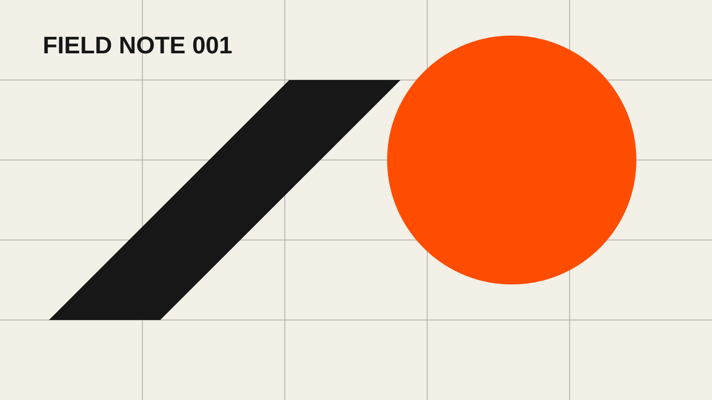

数字花园不是一排完成品，而是一片允许反复修剪的土地。文章可以从三行备忘录开始，在新的阅读和实践里逐渐获得结构。

> 先让想法被看见，再让它变得完整。

## 我使用的状态

| 状态 | 含义 | 下一步 |
| --- | --- | --- |
| 种子 | 一个问题或观察 | 补充上下文 |
| 幼苗 | 已有基本论证 | 加入例子 |
| 常青 | 经多次修订 | 定期校对 |

每篇文章都应该留下继续探索的入口。比如这份博客会把相关主题放进标签页，而不是让文章在发布日期之后彻底沉底。

## 从一个问题开始

写作时先回答：“我希望未来的自己因为什么搜索到这篇文章？”这个问题通常比标题更早揭示内容的真正结构。
